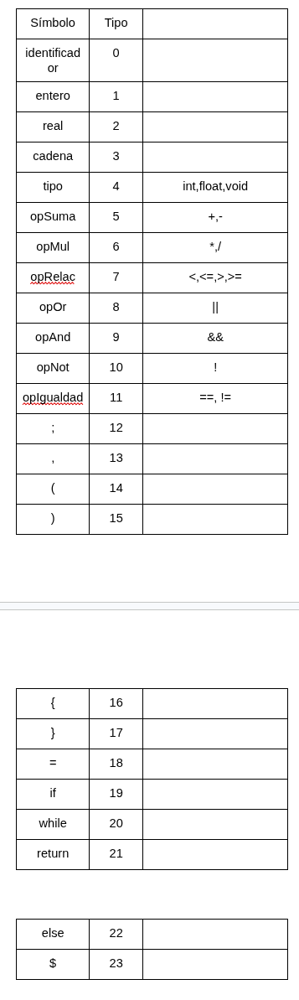

# CARPETA TRADUDUCTORES DE LENGUAJE 2

Este repositorio funciona como carpeta de evidencias sobre actividades y proyectos de la materia *Traductores de lenguaje 2*.

## analizadorLexico.py
Es un pequeño analizador lexico de entradas, este regresa el codigo correspondiente al token analizado.

### Tabla de Tipos



### Ejemplo
**Entrada**
```
if x == 10;
```
**Salida Esperada**
```
if -> 19
x -> 0
== -> 11
10 -> 2
; -> 12
```